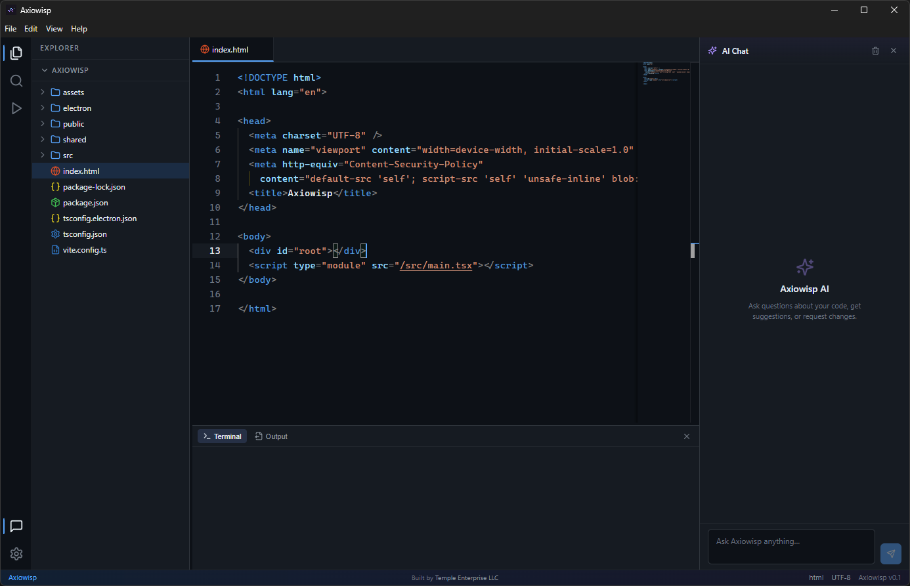

<p align="center">
  
</p>
<p align="center">
  
  
  
  
  
</p>

---

<p align="center">
  <strong>A modern, minimal desktop IDE built with Electron, React, and TypeScript.</strong>
</p>

---

## ✨ Features

- **Monaco Editor** — Full VS Code editing experience with syntax highlighting, IntelliSense, and custom Axiowisp dark theme
- **Real Terminal** — Integrated PowerShell/Bash terminal powered by `node-pty` + `xterm.js`
- **AI Chat** — Built-in OpenAI-powered coding assistant (GPT-4o, GPT-3.5, etc.)
- **Activity Bar** — VS Code-style sidebar navigation (Explorer, Search, Run & Debug)
- **Code Runner** — Execute commands directly from the IDE with streaming output
- **Command Palette** — Quick file/action search with `Ctrl+P`
- **Resizable Panels** — Drag to resize sidebar and terminal panels
- **Settings** — Persistent configuration for editor, terminal, appearance, and API keys
- **Dark Theme** — Carefully crafted dark navy theme with blue/purple accents

## 📸 Showcase

<p align="center">
  
</p>

## 🚀 Getting Started

### Prerequisites

- **Node.js** 18+ ([download](https://nodejs.org/))
- **npm** 9+ (comes with Node.js)
- **Python** 3.x and **Visual Studio Build Tools** (for `node-pty` native compilation on Windows)

### Installation

```bash
# Clone the repository
git clone https://github.com/YOUR_USERNAME/Axiowisp.git
cd Axiowisp

# Install dependencies
npm install

# Start in development mode
npm run dev
```

This launches both the Vite dev server and Electron concurrently with hot-reload.

### Building for Production

```bash
# Compile TypeScript
npx tsc -p tsconfig.electron.json

# Build renderer (Vite)
npx vite build

# Launch Electron with compiled output
npx electron .
```

## 🏗️ Architecture

```
Axiowisp/
├── electron/               # Electron main process
│   ├── main.ts             # Window creation, app lifecycle
│   ├── preload.ts          # Context bridge (IPC API)
│   └── ipc-handlers.ts     # File system, terminal, runner handlers
├── shared/
│   └── types.ts            # Shared TypeScript interfaces & IPC channels
├── src/                    # Renderer (React + Vite)
│   ├── main.tsx            # Entry point + Monaco worker config
│   ├── App.tsx             # Root component + keyboard shortcuts
│   ├── components/
│   │   ├── Layout.tsx      # CSS Grid layout with resizable panels
│   │   ├── ActivityBar.tsx # VS Code-style icon sidebar
│   │   ├── Sidebar.tsx     # Explorer / Search / Run panels
│   │   ├── FileTree.tsx    # Recursive file tree component
│   │   ├── TabBar.tsx      # Open file tabs
│   │   ├── Editor.tsx      # Monaco Editor integration
│   │   ├── BottomPanel.tsx # Terminal (xterm.js) + Output
│   │   ├── ChatPanel.tsx   # AI Chat with OpenAI
│   │   ├── RunPanel.tsx    # Command runner with streaming output
│   │   ├── CommandPalette.tsx # Ctrl+P quick search
│   │   ├── SettingsModal.tsx  # Settings UI
│   │   ├── StatusBar.tsx   # Bottom status bar
│   │   └── WelcomeTab.tsx  # Welcome screen
│   ├── stores/
│   │   ├── ui-store.ts     # UI state (panels, modals)
│   │   ├── tabs-store.ts   # Open file tabs
│   │   ├── workspace-store.ts # Workspace/folder state
│   │   ├── chat-store.ts   # AI chat messages + OpenAI API
│   │   └── settings-store.ts # Persistent settings (localStorage)
│   └── theme/
│       └── tokens.css      # CSS custom properties (design tokens)
├── assets/
│   ├── icon.png            # App icon
│   └── icon-bg.png         # App icon (with background)
├── public/                 # Static assets served by Vite
├── index.html              # HTML entry point
├── vite.config.ts          # Vite configuration
├── tsconfig.json           # TypeScript config (renderer)
├── tsconfig.electron.json  # TypeScript config (main process)
└── package.json
```

## ⚙️ Tech Stack

| Layer | Technology |
|-------|-----------|
| **Framework** | Electron 35 |
| **Renderer** | React 19 + Vite 6 |
| **Language** | TypeScript 5.7 |
| **Editor** | Monaco Editor (`@monaco-editor/react`) |
| **Terminal** | `node-pty` + `@xterm/xterm` |
| **State** | Zustand |
| **Icons** | Lucide React |
| **AI** | OpenAI API (GPT-4o / GPT-3.5) |

## ⌨️ Keyboard Shortcuts

| Shortcut | Action |
|----------|--------|
| `Ctrl+P` | Command Palette |
| `Ctrl+B` | Toggle Sidebar |
| `Ctrl+J` | Toggle Terminal |
| `Ctrl+S` | Save File |
| `Ctrl+Shift+O` | Open Folder |
| `Ctrl+Shift+L` | Toggle AI Chat |
| `Ctrl+W` | Close Tab |

## 🤖 AI Chat Setup

Axiowisp includes a built-in AI coding assistant powered by OpenAI.

1. Open **Settings** (gear icon in the activity bar)
2. Scroll to the **AI / OpenAI** section
3. Enter your OpenAI API key (`sk-...`)
4. Select your preferred model (GPT-4o Mini, GPT-4o, GPT-4 Turbo, or GPT-3.5 Turbo)
5. Open the **AI Chat** panel and start asking questions!

Your API key is stored locally in `localStorage` and never sent anywhere except directly to the OpenAI API.

## 🔒 Security

Axiowisp follows Electron security best practices:

- **Context Isolation**: Enabled — renderer cannot access Node.js APIs directly
- **Node Integration**: Disabled in renderer
- **Content Security Policy**: Strict CSP with explicit allowlists
- **Preload Script**: All IPC communication goes through a typed `contextBridge` API
- **No Remote Content**: No external scripts or remote URLs loaded

---

<p align="center">
  <sub>Built by Temple Enterprise LLC with ❤️ using Electron, React, and TypeScript</sub>
</p>
